# Claude-Optimal Usage Sequence

How to use claude-optimal for Java + Angular full-stack projects.

---

## Sequence Diagram

```mermaid
sequenceDiagram
    participant U as User
    participant CC as Claude Code
    participant P as Profiles
    participant S as Standards
    participant C as Canon Skills

    rect rgb(40, 60, 80)
    Note over U,C: SETUP PHASE (Once per project)

    U->>CC: cd /path/to/smr/admin-angular

    U->>CC: cc-config profile apply software-base+fullstack+angular -p .
    CC->>P: Load profile stack for Java + Angular project
    P->>CC: Create .claude/skills/ with symlinks to:<br/>• kernighan, schneier, owasp, dodds (base)<br/>• bloch (java - Effective Java)<br/>• simpson, cherny (javascript/typescript)<br/>• hevery, kurata, minko-gechev, ben-lesh (angular)
    P->>CC: Add auto-invoke rules to CLAUDE.md
    CC->>U: Profile applied: 14 skills linked, CLAUDE.md updated

    U->>CC: Open docs/FRAMEWORK-TEMPLATES.md
    Note right of U: Copy TWO sections to project CLAUDE.md:<br/><br/>1. "Java Projects" section:<br/>## Java Structural Standards<br/>### Class Design<br/>### Method Design<br/>### API Design (Effective Java)<br/>### Exception Handling<br/>### Anti-Patterns<br/><br/>2. "Angular Projects" section:<br/>## Angular Structural Standards<br/>### Component Architecture<br/>### Services<br/>### Templates<br/>### RxJS Patterns<br/>### Anti-Patterns
    U->>CC: Paste both sections into project CLAUDE.md
    CC->>S: Java anti-patterns now enforced:<br/>❌ God classes (>300 lines)<br/>❌ Null returns for collections<br/>❌ Empty catch blocks<br/>❌ Overuse of inheritance
    CC->>S: Angular anti-patterns now enforced:<br/>❌ subscribe() without cleanup<br/>❌ *ngFor without trackBy<br/>❌ nested subscribes<br/>❌ manual subscription when async pipe works

    U->>CC: /status
    CC->>U: Active:<br/>• Canon: kernighan, bloch, hevery, kurata, ben-lesh...<br/>• Standards: Java + Angular Structural Standards<br/>• Agents: security-auditor, code-reviewer, css-expert
    end

    rect rgb(50, 70, 50)
    Note over U,C: PATH A: NEW FEATURE

    U->>CC: Build client enrollment form with validation --structure-first
    CC->>C: Invoke canon:<br/>• bloch (Java API design for backend)<br/>• hevery (Angular DI/testability)<br/>• kurata (Angular architecture)
    CC->>U: ## Structure Plan<br/><br/>### Java Backend:<br/>1. EnrollmentController - REST endpoints only<br/>2. EnrollmentService - business logic, validation<br/>3. EnrollmentRepository - data access only<br/>4. EnrollmentDTO - immutable, builder pattern<br/><br/>### Angular Frontend:<br/>1. ClientEnrollmentPage (smart) - orchestrates, calls API<br/>2. EnrollmentForm (dumb) - displays form, emits events<br/>3. ValidationMessages (dumb) - shows errors<br/>4. EnrollmentService - HTTP calls only<br/><br/>### Data Flow:<br/>Angular Form → EnrollmentService.save() → HTTP POST<br/>→ Java Controller → Service.validate() → Repository.save()<br/>→ Response DTO → Angular → Update UI<br/><br/>Approve this structure?
    U->>CC: Approved
    CC->>CC: Implement per approved plan
    CC->>U: Feature complete:<br/>• Java: 1 controller, 1 service, 1 repository, 1 DTO<br/>• Angular: 3 components, 1 service

    U->>CC: --review-hard the client enrollment feature I just built
    CC->>S: Check against Java + Angular Structural Standards
    CC->>C: Invoke:<br/>• bloch (immutability, null handling)<br/>• minko-gechev (OnPush)<br/>• ben-lesh (RxJS cleanup)
    CC->>CC: Self-critique: "What would Codex/Gemini/Qodana flag?"
    CC->>U: ## Review Findings<br/><br/>### Java Fixes:<br/>• EnrollmentDTO: made fields final, added builder<br/>• EnrollmentService: return empty List not null<br/>• Added @Valid on controller request body<br/><br/>### Angular Fixes:<br/>• Added trackBy to *ngFor in EnrollmentForm<br/>• Changed to OnPush change detection<br/>• Replaced subscribe() with async pipe<br/><br/>### Verified:<br/>✓ Java: No method exceeds 20 lines<br/>✓ Java: No null returns for collections<br/>✓ Angular: Smart/dumb separation maintained<br/>✓ Angular: All subscriptions have cleanup<br/><br/>Code is now review-ready.
    end

    rect rgb(60, 50, 70)
    Note over U,C: PATH B: REFACTOR EXISTING CODE (Angular)

    U->>CC: --refactor-clean src/app/features/client-admin
    CC->>C: Invoke all Angular canon:<br/>• hevery (DI patterns)<br/>• kurata (module organization)<br/>• minko-gechev (OnPush, performance)<br/>• ben-lesh (RxJS subscription cleanup)
    CC->>CC: Analyze 13 components in client-admin
    CC->>U: ## Refactoring: client-admin (13 components)<br/><br/>### Before:<br/>• client-admin-page.component.ts: 247 lines, 6 responsibilities<br/>• client-search-list: fetches AND transforms AND renders<br/>• 8 components missing trackBy on *ngFor<br/>• 12 naked subscribe() calls without cleanup<br/>• 0 components using OnPush<br/><br/>### After:<br/>• client-admin-page: 89 lines, orchestration only<br/>• ClientSearchService extracted (API calls)<br/>• ClientTransformPipe created (data transforms)<br/>• All *ngFor have trackBy<br/>• All subscriptions use takeUntil(destroy$) or async pipe<br/>• 11/13 components now OnPush<br/><br/>### Changes Made:<br/>• Decomposed 3 god-components into smart/dumb pairs<br/>• Extracted 2 services from components<br/>• Added trackBy to 8 *ngFor loops<br/>• Converted 12 subscribe() to async pipe<br/>• Enabled OnPush on 11 components

    U->>CC: --review-hard the client-admin refactoring I just did
    CC->>S: Check against Angular Structural Standards
    CC->>C: Final pass with all canon
    CC->>CC: Adversarial review: "What would external reviewers still flag?"
    CC->>U: ## Review Findings<br/><br/>### Additional Fixes:<br/>• client-placements: moved Date calculation out of template<br/>• client-diagnoses: extracted repeated filter logic to pipe<br/><br/>### Verified Against Standards:<br/>✓ Smart/dumb separation: 13/13 components<br/>✓ No subscribe() without cleanup: 0 violations<br/>✓ trackBy on all *ngFor: 100%<br/>✓ No function calls in template bindings<br/>✓ OnPush enabled: 11/13 (2 need Default for third-party lib)<br/>✓ Max component size: largest is 142 lines (under 200 limit)<br/><br/>Refactoring complete. Ready for commit.
    end

    rect rgb(70, 50, 50)
    Note over U,C: PATH C: REFACTOR EXISTING CODE (Java)

    U->>CC: --refactor-clean src/main/java/com/oa/smr/adminangular/controller
    CC->>C: Invoke Java canon:<br/>• bloch (Effective Java patterns)<br/>• kernighan (clarity, simplicity)
    CC->>CC: Analyze controllers in package
    CC->>U: ## Refactoring: controller package<br/><br/>### Before:<br/>• ClientController.java: 487 lines, 12 endpoints, mixed concerns<br/>• Business logic in controller methods<br/>• SQL queries called directly from controller<br/>• Mutable DTOs with setters<br/><br/>### After:<br/>• Split into 6 focused controllers (SRP):<br/>  - ClientSearchController (67 lines)<br/>  - ClientCrudController (89 lines)<br/>  - ClientEnrollmentController (54 lines)<br/>  - ClientPlacementController (72 lines)<br/>  - ClientDiagnosisController (48 lines)<br/>  - ClientTagController (41 lines)<br/>• Business logic extracted to services<br/>• Repository pattern for data access<br/>• Immutable DTOs with builders<br/><br/>### Changes Made:<br/>• Decomposed 1 god-controller into 6 focused controllers<br/>• Extracted 4 services from controller logic<br/>• Created 3 repository interfaces<br/>• Converted 8 DTOs to immutable with builders

    U->>CC: --review-hard the Java controller refactoring I just did
    CC->>S: Check against Java Structural Standards
    CC->>C: Final pass with bloch canon
    CC->>CC: Adversarial review: "What would Qodana/SonarQube flag?"
    CC->>U: ## Review Findings<br/><br/>### Additional Fixes:<br/>• ClientSearchService: return Collections.emptyList() not null<br/>• Added @NotNull annotations on required parameters<br/>• Wrapped checked exceptions in domain exceptions<br/><br/>### Verified Against Standards:<br/>✓ No controller method exceeds 20 lines<br/>✓ No business logic in controllers<br/>✓ All DTOs immutable (final fields, no setters)<br/>✓ No null returns for collections<br/>✓ Builder pattern for DTOs with >3 fields<br/>✓ Proper exception handling (no empty catch)<br/><br/>Refactoring complete. Ready for commit.
    end
```



---

## Command Reference

### SETUP (Once per project)

| Step | Command | What It Does |
|------|---------|--------------|
| 1 | `cd /path/to/smr/admin-angular` | Navigate to project root |
| 2 | `cc-config profile apply software-base+fullstack+angular -p .` | Links canon skills for **Java + Angular**:<br/>• **Base**: kernighan, schneier, owasp, dodds<br/>• **Java**: bloch<br/>• **JS/TS**: simpson, cherny<br/>• **Angular**: hevery, kurata, minko-gechev, ben-lesh |
| 3 | Copy from `FRAMEWORK-TEMPLATES.md` to project CLAUDE.md:<br/>• **"Java Projects"** section<br/>• **"Angular Projects"** section | Adds anti-patterns and structural rules for both Java and Angular layers |
| 4 | `/status` | Verify all canon active |

---

### PATH A: New Feature (Full Stack)

| Step | Command | What It Does |
|------|---------|--------------|
| 1 | `Build client enrollment form with validation --structure-first` | Claude plans both Java backend (controller, service, repository, DTO) and Angular frontend (components, services), shows data flow, waits for approval |
| 2 | `Approved` | Claude implements per plan |
| 3 | `--review-hard the client enrollment feature I just built` | Claude reviews both Java and Angular code against standards, fixes violations, reports what was fixed |

---

### PATH B: Refactor Angular Frontend

| Step | Command | What It Does |
|------|---------|--------------|
| 1 | `--refactor-clean src/app/features/client-admin` | Claude analyzes Angular components, decomposes god-components, fixes RxJS patterns, adds OnPush, shows before/after |
| 2 | `--review-hard the client-admin refactoring I just did` | Claude reviews refactored Angular code, catches remaining issues, verifies against Angular standards |

---

### PATH C: Refactor Java Backend

| Step | Command | What It Does |
|------|---------|--------------|
| 1 | `--refactor-clean src/main/java/.../controller` | Claude analyzes Java classes, splits god-classes, extracts services, applies Effective Java patterns, shows before/after |
| 2 | `--review-hard the Java controller refactoring I just did` | Claude reviews refactored Java code, checks for null returns, immutability, exception handling |

---

## Profile Stack Explained

```
software-base+fullstack+angular
│
├── software-base (always included)
│   ├── kernighan    → Code clarity, simplicity
│   ├── schneier     → Security mindset
│   ├── owasp        → Vulnerability patterns
│   └── dodds        → Testing patterns
│
├── fullstack (Java + JavaScript)
│   ├── bloch        → Effective Java
│   ├── simpson      → You Don't Know JS
│   └── cherny       → Programming TypeScript
│
└── angular (Angular-specific)
    ├── hevery       → DI, testability, signals
    ├── kurata       → Architecture, RxJS patterns
    ├── minko-gechev → Performance, OnPush, lazy loading
    └── ben-lesh     → RxJS streams, operators
```

---

## Key Insight

> Canon is always alive - it's the lens through which ALL work is done, not just when flags are used.

The flags (`--structure-first`, `--refactor-clean`, `--review-hard`) add **enforcement and visibility**, but the canon skills shape every response whether you use flags or not.
