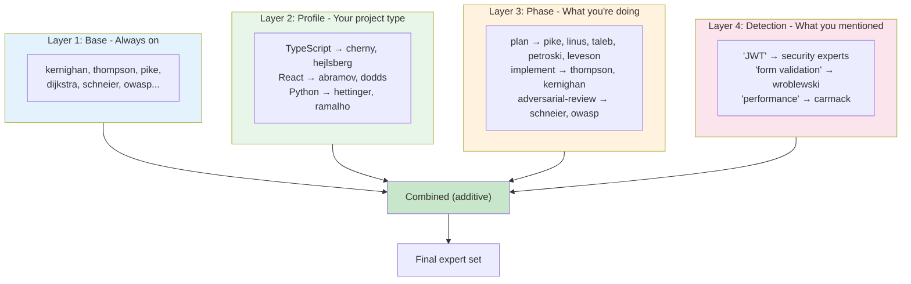

# How Skills Get Loaded

When you work, the system loads expert guidance through four layers.



## The Formula

```
Loaded Experts = Base + Profile + Phase + Detected Keywords
```

---

## Layer 1: Base (Always On)

Every software project gets these core experts automatically:

| Expert | Focus |
|--------|-------|
| Kernighan | Clarity, readability |
| Thompson | Get it working first |
| Pike | Small interfaces |
| Dijkstra | Correctness |
| Schneier | Security thinking |
| OWASP | Vulnerability patterns |

**File:** `profiles/software-base.yaml`

---

## Layer 2: Profile (Project Type)

Set once when you configure the project:

| Profile | Experts |
|---------|---------|
| typescript-cli | cherny, hejlsberg, crockford, kyle-simpson, osmani |
| react | abramov, dodds, frost, cherny |
| python | hettinger, ramalho, slatkin, beazley |
| java | bloch |
| angular | hevery, kurata, minko-gechev, ben-lesh |

**File:** `profiles/{name}.yaml`

---

## Layer 3: Phase (What You're Doing)

The 8 workflow phases, each with different experts:

```
/plan → /structure-first → /implement → /build-tests →
/refactor-check → /adversarial-review → /static-analysis → /doc-code
```

| Phase | Experts | Focus |
|-------|---------|-------|
| **plan** | kernighan, pike, linus, dijkstra, liskov, porter, rumelt, taleb, petroski, leveson | Requirements, design |
| **structure-first** | linus, cherny, dijkstra, liskov, bloch, gang-of-four | Data structures, types |
| **implement** | thompson, kernighan, pike, mcilroy, bill-joy, carmack | Write the code |
| **build-tests** | meszaros, fowler-test, dodds, hevery, feathers | Write tests |
| **refactor-check** | kernighan, thompson, feathers, gang-of-four, pike | Clean up |
| **adversarial-review** | schneier, owasp, tanya-janca, troy-hunt, petroski, leveson, taleb | Security review |
| **static-analysis** | bloch, liskov, owasp, crockford | Run analyzers |
| **doc-code** | procida, strunk-white, zinsser, king | Documentation |

> **Commands** = run one phase
> **Ralph** = loop through all phases in order

**File:** `config/workflow-phases.yaml`

---

## Layer 4: Detection (What You Mentioned)

Keywords in your prompt trigger additional experts:

| Keywords | Adds |
|----------|------|
| auth, password, JWT, token, session | schneier, owasp, tanya-janca, troy-hunt |
| test, mock, coverage, jest, vitest | meszaros, fowler-test, dodds |
| API, endpoint, REST, graphql | bloch, pike |
| performance, optimize, cache | carmack, knuth |
| form, validation, input | wroblewski, norman |
| react, hook, state, redux | abramov, dodds |
| typescript, type, generic | cherny, hejlsberg |
| chart, visualization, d3 | tufte, few, bostock |
| cli, terminal, shell, pipe | mcilroy, pike, kernighan |
| algorithm, sort, tree, graph | knuth, dijkstra |

**File:** `config/keyword-detection.yaml`

---

## File Reference

| Layer | File |
|-------|------|
| Base (always on) | `profiles/software-base.yaml` |
| Profile (project type) | `profiles/{name}.yaml` |
| Phase experts | `config/workflow-phases.yaml` |
| Keyword detection | `config/keyword-detection.yaml` |

---

## Implementation

The loading logic is in:
- `cli/src/ralph/phases/loader.ts` - Loads YAML, compiles rules
- `cli/src/ralph/phases/index.ts` - Phase factory
- `cli/src/ralph/types.ts` - Type definitions

Key functions:
- `loadPhaseConfig()` - Load workflow-phases.yaml
- `loadKeywordRules()` - Load keyword-detection.yaml
- `detectExperts()` - Combine all 4 layers
- `createPhases()` - Create the 8 phase instances
