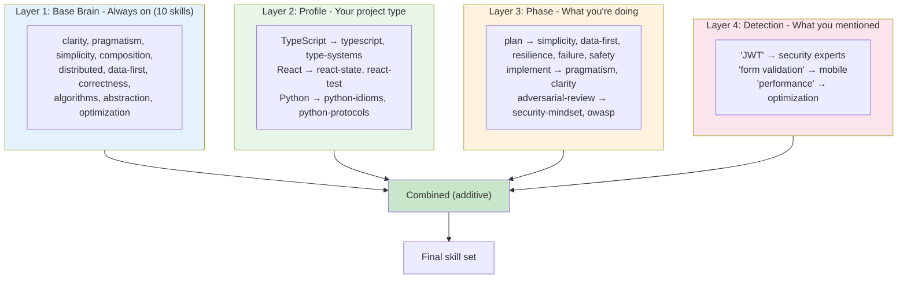

---
**STRICTLY CONFIDENTIAL**

This document contains proprietary and confidential information. Unauthorized reproduction, distribution, or disclosure is strictly prohibited. This material is intended solely for authorized recipients.

---

# How Skills Get Loaded

When you work, the system loads expert guidance through four layers.



## The Formula

```
Loaded Skills = Base + Profile + Phase + Detected Keywords
```

---

## Layer 1: Base Brain (Always On)

Every software project gets the **Base Brain** — 10 foundational skills loaded automatically:

| Skill | Focus |
|-------|-------|
| clarity | Clarity, readability, no cleverness |
| pragmatism | Get it working first, brute force is fine |
| simplicity | Small interfaces, composition over inheritance |
| composition | Unix philosophy, do one thing well |
| distributed | Failure handling, distributed systems |
| data-first | Data structures first, algorithms follow |
| correctness | Formal discipline, correctness by construction |
| algorithms | Algorithmic rigor, literate programming |
| abstraction | Substitution principle, type contracts |
| optimization | Performance, measure before optimizing |

**Context cost:** ~4,200 tokens (~2% of context window)

**File:** `profiles/software-base.yaml`

---

## Layer 2: Profile (Project Type)

Set once when you configure the project:

| Profile | Skills |
|---------|--------|
| typescript-cli | typescript, type-systems, js-safety, js-internals, js-perf |
| react | react-state, react-test, components, typescript |
| python | python-idioms, python-protocols, python-patterns, python-advanced |
| java | java |
| angular | angular-core, angular-arch, angular-perf, rxjs |

**File:** `profiles/{name}.yaml`

---

## Layer 3: Phase (What You're Doing)

The `/build` and `/improve` pipelines run 9 phases, each with different skills:

| # | Phase | Base Brain | Domain Skills | Focus |
|---|-------|------------|---------------|-------|
| 1 | **create-plan** | All 10 | [if auth] security-mindset, owasp | Requirements, design |
| 2 | **structure-first** | All 10 | [if TS] typescript | Data structures, types |
| 3 | **implement-plan** | All 10 | [if TS] typescript, [if auth] security | Write the code |
| 4 | **refactor-check-fix** | All 10 | design-patterns, refactoring | Clean up |
| 5 | **dedupe-fix** | — | composition, clarity, simplicity | Remove duplication |
| 6 | **gemini-fix** | — | — | External code + product quality review (Gemini MCP) |
| 6.5 | *machine gate* | — | — | Qodana scan; Haiku fixer if issues found |
| 7 | **adversarial-security-review** | — | security-mindset, owasp, web-security | Security review |
| 8 | **write-tests-run** | — | test-doubles, test-strategy | Write tests |
| 9 | **ai-smell-fix** | — | — | Remove AI patterns |
| 9.5 | *machine gate* | — | — | `npm test` + quality-gate (final) |

Machine gates run between phases 3-4, 6-7, and after 9.

> **Commands** = run one phase
> **Ralph** = iterates plan → build → refactor → test → review → doc per PRD item

**File:** `config/workflow-phases.yaml`

---

## Layer 4: Detection (What You Mentioned)

Keywords in your prompt trigger additional skills:

| Keywords | Adds |
|----------|------|
| auth, password, JWT, token, session | security-mindset, owasp, appsec, web-security |
| test, mock, coverage, jest, vitest | test-doubles, test-strategy, react-test |
| API, endpoint, REST, graphql | java, simplicity |
| performance, optimize, cache | optimization, algorithms |
| form, validation, input | mobile, usability |
| react, hook, state, redux | react-state, react-test |
| typescript, type, generic | typescript, type-systems |
| chart, visualization, d3 | charts, dashboards, d3 |
| cli, terminal, shell, pipe | composition, simplicity, clarity |
| algorithm, sort, tree, graph | algorithms, correctness |

**File:** `config/keyword-detection.yaml`

---

## File Reference

| Layer | File |
|-------|------|
| Base (always on) | `profiles/software-base.yaml` |
| Profile (project type) | `profiles/{name}.yaml` |
| Phase skills | `config/workflow-phases.yaml` |
| Keyword detection | `config/keyword-detection.yaml` |

---

## Implementation

The loading logic is in:
- `src/ralph/phases/loader.ts` - Loads YAML, compiles rules
- `src/ralph/phases/index.ts` - Phase factory
- `src/ralph/types.ts` - Type definitions

Key functions:
- `loadPhaseConfig()` - Load workflow-phases.yaml
- `loadKeywordRules()` - Load keyword-detection.yaml
- `detectSkills()` - Combine all 4 layers
- `createPhases()` - Create the 9 phase instances
