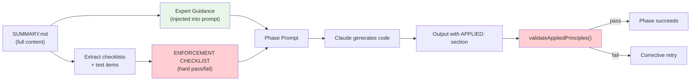

---
**STRICTLY CONFIDENTIAL**

This document contains proprietary and confidential information. Unauthorized reproduction, distribution, or disclosure is strictly prohibited. This material is intended solely for authorized recipients.

---

# Skill Enforcement Model

*How canon skills go from guidance to enforceable gates.*

---

## The Problem

Skills were loaded but not enforced. The system had three gaps:

1. **Truncation**: Skills (275-365 lines each) were cut to 50 lines before injection — losing 85% of content including examples, checklists, and boundary conditions.
2. **No validation**: Phases asked for an `APPLIED:` section but never checked it existed or contained real decisions.
3. **Advisory, not prescriptive**: Skill content appeared as guidance text. Nothing structurally prevented the LLM from ignoring it entirely.

The result: Claude could claim to follow Kernighan's clarity principles while writing 80-line functions with single-letter variable names.

---

## The Enforcement Model

Three mechanisms now work together:



### Layer 1: Full Skill Content (Fix: No Truncation)

**Before:** `extractCore()` stripped skills to 50 lines.

**After:** `buildExpertGuidance()` uses the complete `SUMMARY.md` — a curated distillation of each skill that includes tables, code examples, quick-reference sections, and the master's test. When no `SUMMARY.md` exists, the full `SKILL.md` is used with only YAML frontmatter stripped.

| Skill | SKILL.md lines | SUMMARY.md lines | Old (truncated) |
|-------|---------------|-------------------|-----------------|
| clarity | 147 | 47 | 50 |
| simplicity | 365 | 67 | 50 |
| correctness | 308 | 71 | 50 |
| pragmatism | 292 | 85 | 50 |
| data-first | 302 | 58 | 50 |

SUMMARY.md files are purpose-built for prompt injection: dense, structured, example-rich.

---

### Layer 2: Enforcement Checklist (Fix: Hard Gates)

Each skill contains enforcement items in two formats:

**Checklist sections** (`## Checklist`, `## Code Review Checklist`):
```markdown
- [ ] Every function does one thing, name says what
- [ ] No cleverness requiring explanation
- [ ] Names are self-documenting
```

**Master test sections** (`## The Kernighan Test`, `## The Pike Test`):
```markdown
1. Can I explain this in one sentence?
2. Would I understand this at 3am during an outage?
3. Is there a more obvious way?
4. Am I being clever? (If yes, stop)
```

Both are extracted at load time and combined into a single `ENFORCEMENT CHECKLIST` block appended to every prompt:

```
## ENFORCEMENT CHECKLIST (PASS/FAIL — NOT OPTIONAL)

Your code MUST pass ALL of these checks. If any check fails, your output is rejected.

- [clarity] Every function does one thing, name says what
- [clarity] No cleverness requiring explanation
- [clarity] Can I explain this in one sentence?
- [clarity] Would I understand this at 3am during an outage?
- [simplicity] No premature optimization (measured first?)
- [simplicity] Simplest algorithm that works
- [simplicity] Interfaces are small (1-3 methods)
- [correctness] Code is structured (sequence, selection, iteration only)
- [correctness] Each function has clear pre/postconditions
...

For each item in APPLIED:, cite the specific checklist item it satisfies.
Generic claims like "applied clarity principles" will be rejected.
```

This transforms advisory guidance into an explicit contract.

---

### Layer 3: APPLIED Validation (Fix: Post-Generation Check)

After code generation, `validateAppliedPrinciples()` checks the output:

| Check | Failure Mode | Error |
|-------|-------------|-------|
| APPLIED section exists | Missing entirely | `Missing APPLIED section` |
| Has bullet items | Empty section | `APPLIED section is empty` |
| Every expert cited | Expert not mentioned | `Missing decisions for: simplicity, correctness` |
| Decisions are specific | Generic phrasing | `Contains generic claims: "applied clarity principles"` |

**Generic claim detection** rejects these patterns:
- `applied X principles`
- `followed X guidance`
- `used X best practices`
- `considered X approach`

A valid APPLIED entry looks like:
```
- clarity: used early returns to flatten nesting in parseConfig, renamed 'd' to 'configData'
- simplicity: chose linear scan over hash map — only 12 items, O(n) is clearer
- correctness: added precondition check for null projectPath before fs operations
```

Failures trigger the existing corrective retry mechanism — the phase re-runs with a corrective prompt explaining what was wrong.

---

## Where Enforcement Runs

| Phase | Checklist Injected | APPLIED Validated |
|-------|-------------------|-------------------|
| plan | Yes | Yes |
| structure | Yes | No |
| implement | Yes | Yes |
| refactoring | Yes | Yes |
| test | Yes | No |
| doc-code | Yes | No |
| independent-review | No (uses Gemini) | No |
| static-analysis | No (uses Qodana) | No |

Phases that use external tools (Gemini, Qodana) bypass the enforcement model — they have their own validation.

---

## The Data Flow

```
loadSkill()
  ├── reads SKILL.md → skill.content
  ├── reads SUMMARY.md → skill.summary
  └── extractChecklist(summary) → skill.checklist[]
        ├── matches "## *Checklist*" → extracts "- [ ]" items
        └── matches "## The X Test" → extracts numbered items

buildExpertGuidance(experts)
  ├── for each expert: uses summary (or stripped content as fallback)
  ├── buildEnforcementChecklist(experts)
  │     └── aggregates all checklist items with [expert-name] prefix
  └── returns guidance + checklist as single prompt block

Phase.execute()
  ├── builds prompt with expert guidance + enforcement checklist
  ├── runs Claude
  ├── validates output format (existing checks)
  └── validateAppliedPrinciples(output, experts)
        ├── checks APPLIED section exists and is non-empty
        ├── checks every expert name appears in citations
        ├── rejects generic phrasings
        └── returns error (triggers corrective retry) or null (passes)
```

---

## Limitations

**What this enforces:**
- Skills are fully present in prompts (not truncated)
- LLM must acknowledge each expert with a specific decision
- Generic hand-waving is structurally rejected

**What this does not enforce:**
- Whether the cited decisions actually match the generated code
- Whether the code semantically satisfies the checklist items
- Quality of the code beyond mechanical checks (30-line functions, no vague names)

The gap between "cited a decision" and "actually followed through" still relies on LLM faithfulness. A future improvement could add a verification pass that re-reads generated code against the checklist — but the current model catches the most common failure mode: skills being invisible or ignored entirely.

---

## Key Files

| File | Purpose |
|------|---------|
| `src/types.ts` | `Skill` interface with `summary` and `checklist` fields |
| `src/canon/skill-loader.ts` | Loads SUMMARY.md, extracts checklist items from both formats |
| `workflow-skills/workflow/plan/SKILL.md` | Plan phase with enforcement checklist |
| `workflow-skills/workflow/implementation/SKILL.md` | Implementation phase with principle validation |
| `workflow-skills/workflow/refactoring/SKILL.md` | Refactoring phase with principle validation |

---

## Relationship to Five-Layer Enforcement

This document describes the skill enforcement model — Layer 1 (canon at write-time) of the five-layer system. The full five layers are:

1. **Canon skills at write-time** — This model (guidance + checklist + APPLIED validation)
2. **Refactor/dedupe phases** — Structural cleanup
3. **External review** — Gemini MCP + Qodana static analysis
4. **Security + AI smell** — Adversarial review + antipattern removal
5. **Machine gates** — `npm run build && npm test` between phase groups

See [Quality Gate Spec](../quality-gate-spec.md) for the machine gate specification.

---

## Further Reading

- [How the Pipeline Works](how-the-pipeline-works.md) — The 8-phase pipeline, including skill loading
- [Why Expert Skills?](why-expert-skills.md) — Philosophy behind skill lenses
- [Why Five Layers Wins](../why-five-layers-wins.md) — Competitive analysis
